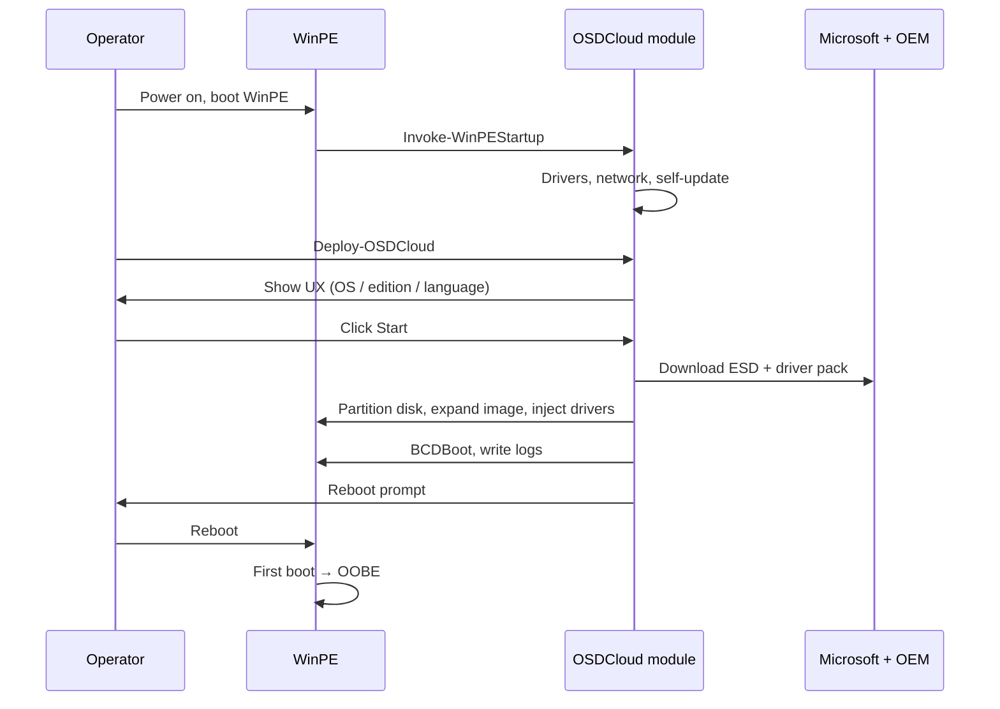

# Deploy Windows 11 End-to-End

## When to use this

Use this guide for the first time you deploy Windows with OSDCloud. It is
the happy-path walkthrough an operator follows from a powered-off device to
a freshly installed Windows 11 at the OOBE screen.

## Why this workflow

OSDCloud splits the deployment into two halves:

1. **WinPE startup** — `Invoke-WinPEStartup` brings the environment online
   (drivers, network, current module).
2. **OS deployment** — `Deploy-OSDCloud` runs a 40-step workflow that
   installs Windows and injects drivers.

Each half is a single command so you can script either independently.

## Prerequisites

- A WinPE boot image with OSDCloud available — see [guide 2](02-build-boot-image.md).
- A device booted into WinPE — see [guide 3](03-boot-device.md).
- Wired or Wi-Fi network access from WinPE.
- 6 GB RAM (4 GB minimum — a warning is shown below 6 GB).
- A local disk with at least 64 GB free space.

## The deployment flow



## Step-by-step

### 1. WinPE boots

If your boot image runs `Invoke-WinPEStartup` from `startnet.cmd`, the
startup sequence begins automatically. Otherwise, run it manually:

```powershell
Install-Module OSDCloud -SkipPublisherCheck -Force
Import-Module OSDCloud
Invoke-WinPEStartup
```

What happens during startup:

| Step | Purpose |
|---|---|
| Environment / drivers / files | Initialize WinPE and load any OEM driver overrides from the USB |
| `wpeinit` / `wpeutil` | Standard Microsoft WinPE init |
| On-screen keyboard | Shown for tablets — dismiss if not needed |
| Wi-Fi connect | Prompts to pick an SSID and enter the key (skip if wired) |
| IP config display | Shows the resulting `ipconfig /all` |
| Module update | Self-updates OSDCloud from PSGallery |
| Main command | Runs `Show-OSDCloudDeviceInfo` then `Deploy-OSDCloud` |

### 2. Confirm device info

`Show-OSDCloudDeviceInfo` prints make/model, serial, TPM, Secure Boot,
disk, memory, and battery state. Verify nothing looks wrong (no disk, no
TPM on a device that needs it, on battery and unplugged) before continuing.

### 3. Choose deployment options in the UX

`Deploy-OSDCloud` opens the deployment UX. Defaults are sensible — change
only what you need:

| Setting | Default | Notes |
|---|---|---|
| Operating System | Windows 11 25H2 | 24H2 and 23H2 also available |
| Activation | Retail | Use Volume for VL/MAK keys |
| Edition | Pro | Home / Pro / Enterprise (+ Education and N variants on amd64) |
| Language | en-us | 38 codes (amd64) / 37 codes (arm64) |

Click **Start** to begin.

To skip the UX entirely (scripted runs):

```powershell
Deploy-OSDCloud -CLI
```

On devices with multiple local disks, specify the deployment target explicitly:

```powershell
Deploy-OSDCloud -CLI -DiskNumber 1
```

The disk number must be one of the local deployment disks detected by OSDCloud.
USB, virtual, offline, and otherwise unsupported disks are not valid targets.

### 4. The 40-step workflow runs

Phases run in order:

1. **Validate** — target disk, image, driver pack reachable.
2. **Pre-install** — clear and partition the local disk (UEFI / GPT).
3. **Install** — download ESD from Microsoft, expand to disk, write BCD.
4. **Drivers** — inject WinPE OEM, firmware, OEM driver pack, Microsoft Update drivers.
5. **Finalize** — stage PowerShell modules and OOBE customizations, export logs.

The full step list (with `skip` defaults and per-step notes) is in
[guide 5 — Customize the deployment](05-customize-deployment.md#the-default-workflow-40-steps).

Progress prints to the console. Total time is typically 10–25 minutes
depending on internet speed and disk type.

### 5. Reboot to OOBE

When the workflow finishes the device is ready to reboot:

```powershell
wpeutil reboot
```

The device boots into Windows OOBE. From here you can:

- Complete OOBE manually, or
- Hand off to Autopilot for Intune enrolment — see [guide 8](08-autopilot-oobe.md).

## If something fails

Logs are written to `C:\Windows\Temp\osdcloud-logs\`. Start with
[guide 9 — Troubleshooting](09-troubleshooting.md).

## Next

- [Customize the deployment](05-customize-deployment.md) — pick a different OS or edition, or change workflow settings.
- [Run unattended with a USB profile](06-unattended-usb-profile.md) — remove the operator from the loop.
